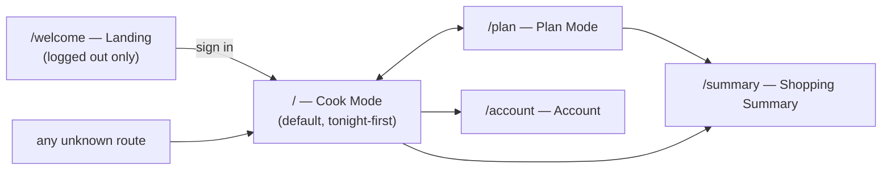

# Design Spec — Vega Plan Hub

Status: binding. Extracted 2026-07-17 from the shipped app (commit
`fe922eb`) as part of execplan `p1-01-spec-extraction`. UX structure and
visual identity; implementation tokens and code rules live in
[conventions.spec.md](conventions.spec.md).

## Voice and feel

Playful, warm, food-forward. Vibrant gradients, rounded corners, bouncy
hover animations, and **emojis in all user-facing copy** (🥗👨‍🍳⏰✨ —
palette in conventions.spec.md). Serious utility underneath: the fun
never gets in the way of planning or shopping. Copy is in English;
prices and units are Swedish (SEK, metric).

## Information architecture

- **Cook Mode is home.** A signed-in user lands on tonight's meal, not a
  dashboard. Tonight-first is the core UX bet.
- All routes except `/welcome` require auth; unknown routes redirect to
  `/`, logged-out users to `/welcome`.

## Screens

| Screen | Purpose | Key elements |
| --- | --- | --- |
| Landing (`/welcome`) | Sell the app, sign in/up | Hero, value props, auth entry |
| Cook Mode (`/`) | Cook tonight's meal | Today's recipe card; per-day servings stepper (multiplier ±); scaled ingredient list; step-by-step instructions; link out to original recipe; week overview navigation |
| Plan Mode (`/plan`) | Build current/next week | Weekday slots (Mon–Sun); recipe picker from the library; servings slider per day; clear/reset; hand-off to summary |
| Shopping Summary (`/summary`) | Shop the week | Aggregated, normalized, scaled ingredient list with checkboxes; SEK estimates; print and copy-to-clipboard actions; back to plan |
| Account (`/account`) | Household settings | Profile, family members (for ratings/tastes), sign out |

## Interaction rules

- Portion scaling is always visible where food quantities are shown, and
  scaling updates ingredients immediately (multiplier per day, slider or
  ± stepper).
- Loading states: centered spinner (`animate-spin` ring) during auth/data
  fetch — never a blank screen.
- Feedback: toasts (shadcn toast + sonner) for actions like copying the
  shopping list.
- Checkable shopping list items; print view is uncluttered.
- Hover states animate (scale/translate + shadow tokens); transitions
  ~300ms.

## Visual identity

Semantic tokens only (definitions in `src/index.css`, rules in
conventions.spec.md): purple `primary`, food-named accent colors
(`forest`, `citrus`, `carrot`, `berry`, `avocado`), gradient utilities
(`bg-gradient-primary/-fresh/-warm/-fun`), playful shadows
(`shadow-fresh/-glow/-playful`). Recipe imagery is full-bleed photos
from the source sites. Accessibility floor: shadcn defaults, semantic
HTML, labeled icon buttons, visible focus, sufficient contrast.
