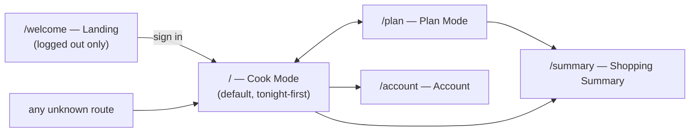

# Design Spec — Vega Plan Hub

Status: binding. Extracted 2026-07-17 from the shipped app (commit
`fe922eb`) as part of execplan `p1-01-spec-extraction`. UX structure and
visual identity; implementation tokens and code rules live in
[conventions.spec.md](conventions.spec.md).

## Voice and feel

**"Kreuzberg minimal"** (adopted 2026-07-18 by human pick from three
mockups, replacing the gradient-heavy look): simple, quirky, clean —
Berlin vegan. Warm off-white + ink + **one green**; flat 1px borders
carry the structure; **no gradients, no decorative shadows**. Emojis are
the only iconography in content (🥗👨‍🍳⏰ — lucide icons remain only as
functional UI glyphs in headers/controls). Compassion is part of the
voice: animal-love and respect accents in copy ("🐮💚 zero animals
harmed"; the footer motto "cooked with compassion · for the animals,
the planet & each other 🐾🌍💚" on every main screen). Serious utility
underneath: the quirk never gets in the way of planning or shopping.
Copy is in English; prices and units are Swedish (SEK, metric).
**Dark and light mode are both first-class** — every screen must work
in each, toggled via the ☀️/🌙 pill present in every header.

## Information architecture

- **Cook Mode is home.** A signed-in user lands on tonight's meal, not a
  dashboard. Tonight-first is the core UX bet.
- All routes except `/welcome` require auth; unknown routes redirect to
  `/`, logged-out users to `/welcome`.

## Screens

| Screen | Purpose | Key elements |
| --- | --- | --- |
| Landing (`/welcome`) | Sell the app, sign in/up | Hero, value props, auth entry |
| Cook Mode (`/`) | Cook tonight's meal | Today's recipe card; per-day servings stepper (multiplier ±); scaled ingredient list; step-by-step instructions; link out to original recipe; week overview navigation |
| Plan Mode (`/plan`) | Build current/next week | Weekday slots (Mon–Sun); recipe picker from the library; servings slider per day; clear/reset; hand-off to summary |
| Shopping Summary (`/summary`) | Shop the week | Aggregated, normalized, scaled ingredient list with checkboxes; SEK estimates; print and copy-to-clipboard actions; back to plan |
| Account (`/account`) | Household settings | Profile, family members (for ratings/tastes), sign out |

## Interaction rules

- Portion scaling is always visible where food quantities are shown, and
  scaling updates ingredients immediately (multiplier per day, slider or
  ± stepper).
- Loading states: centered spinner (`animate-spin` ring) during auth/data
  fetch — never a blank screen.
- Feedback: toasts (shadcn toast + sonner) for actions like copying the
  shopping list.
- Checkable shopping list items; print view is uncluttered.
- Hover states animate (scale/translate + shadow tokens); transitions
  ~300ms.

## Visual identity

Semantic tokens only (definitions in `src/index.css` `:root` + `.dark`,
rules in conventions.spec.md). The palette:

| Token | Light | Dark |
| --- | --- | --- |
| background | `#FAF7F0` warm off-white | `#171714` warm near-black |
| foreground | `#1A1A17` ink | `#F1EEE6` bone |
| card | `#FFFEF9` | `#1D1D19` |
| border/input | `#E4DFD2` | `#2C2C27` |
| muted-foreground | `#6B675C` | `#9B978A` |
| primary (the one green) | `#3D7A4E` | `#7CB08A` |

Rules: no gradients, ever; no glow/bounce shadows — flat surfaces with
1px borders; primary CTAs are green pills (`rounded-full`), secondary
emphasis is the inverted ink pill (`bg-foreground text-background`);
hover states are color shifts or ≤2% scale, never bounces. Functional
photo scrims (`bg-gradient-to-*` over images for text legibility) are
the only permitted gradient use. Recipe imagery is full-bleed photos
from the source sites. Accessibility floor: shadcn defaults, semantic
HTML, labeled icon buttons, visible focus, sufficient contrast — in
both modes.
