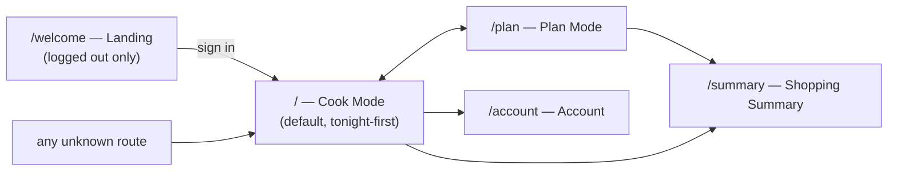

# Design Spec — Vega Plan Hub

Status: binding. Extracted 2026-07-17 from the shipped app (commit
`fe922eb`) as part of execplan `p1-01-spec-extraction`. UX structure and
visual identity; implementation tokens and code rules live in
[conventions.spec.md](conventions.spec.md).

## Voice and feel

**"Kreuzberg minimal"** (adopted 2026-07-18 by human pick from three
mockups, replacing the gradient-heavy look): simple, quirky, clean —
Berlin vegan. Warm off-white + ink + **one green**; flat 1px borders
carry the structure; **no gradients, no decorative shadows**. Emojis are
the only iconography in content (🥗👨‍🍳⏰ — lucide icons remain only as
functional UI glyphs in headers/controls). Compassion is part of the
voice: animal-love and respect accents in copy ("🐮💚 zero animals
harmed"; the footer motto "cooked with compassion · for the animals,
the planet & each other 🐾🌍💚" on every main screen). Serious utility
underneath: the quirk never gets in the way of planning or shopping.
Copy is in English; prices and units are Swedish (SEK, metric).
**Recipe content is Swedish-first** (directive Pelle 2026-08-27,
[p4-14-swedish-recipe-corpus](../execplans/p4-14-swedish-recipe-corpus.md)):
every recipe in `src/data/recipes/` — title (where a Swedish name is
natural; established international dish names like "Mapo Tofu" and
"Chana Dal" stay as-is), ingredient display names, instructions, and
notes — is written in Swedish. App chrome (buttons, headers, empty
states, toasts) stays English for now — a separate decision, not yet
made. Machine identity (recipe `id` slugs, ingredient `key` values,
frontmatter field names, the controlled English tag vocabulary in
[recipe-format.spec.md](recipe-format.spec.md)) is unaffected by
recipe content language.
**Dark and light mode are both first-class** — every screen must work
in each, toggled via the ☀️/🌙 pill present in every header.

## Information architecture

```mermaid
flowchart LR
    W["/welcome — Landing<br/>(logged out only)"] -->|sign in| C
    C["/ — Cook Mode<br/>(default, tonight-first)"] <--> P["/plan — Plan Mode"]
    P --> S["/summary — Shopping Summary"]
    C --> S
    C --> A["/account — Account"]
    X["any unknown route"] --> C
```

- **Cook Mode is home.** A signed-in user lands on tonight's meal, not a
  dashboard. Tonight-first is the core UX bet.
- **Pool over calendar** (directive Pelle 2026-08-27): a plan batch is
  a *pool* of meals with counts ("these dishes are in this plan"), not
  per-day assignments. The household picks each day's dish from the
  remaining pool when they decide to cook. **A batch has a start but no
  end** (directive Pelle 2026-08-27, evening — reverses the same-day
  "covered range" wording): nobody knows when the last dishes get
  cooked, so a batch never expires by date. It ends only by being
  *finished* (every dish cooked) or *superseded* (a newer batch starts
  — the reset). The UI shows the start date and the cooked count,
  never an end date; the drafting ritual in chat may still use a
  horizon ("planera 5 dagar") to size the pool, but that horizon is a
  sizing hint, not a deadline. This supersedes the weekday-slot model
  below wherever the two conflict; the web adoption is `p4-12`.
- All routes except `/welcome` require auth; unknown routes redirect to
  `/`, logged-out users to `/welcome`.

## Screens

| Screen | Purpose | Key elements |
| --- | --- | --- |
| Landing (`/welcome`) | Sell the app, sign in/up | Hero, value props, auth entry |
| Cook Mode (`/`) | Cook tonight's meal | Tonight's pick from the batch pool (choose-from-remaining picker; already-cooked entries shown as done); servings stepper (multiplier ±); scaled ingredient list; step-by-step instructions; link out to original recipe; batch overview navigation; deep-linkable via `?recipe=&scale=` (below) |
| Plan Mode (`/plan`) | Build the active batch | The batch's meal pool as a list (dish × count, 🍱 meal-prep badge); recipe picker from the library; servings multiplier per meal; clear/reset; hand-off to summary |
| Shopping Summary (`/summary`) | Shop the week | Aggregated, normalized, scaled ingredient list with checkboxes; SEK estimates; print and copy-to-clipboard actions; back to plan |
| Account (`/account`) | Household settings | Profile, family members (for ratings/tastes), sign out |

**Cook Mode deep links** (adopted 2026-08-27, `p4-11`): `/?recipe=<markdown
recipe id>` opens Cook Mode with that recipe selected, bypassing the day
picker — the link target contract for the Telegram bot's "🍳 Cook mode"
button and every per-meal link in the p4-10 menu card/PDF. An unknown id
falls back to the normal tonight-first view plus a friendly 🤷 toast —
never a crash. `?scale=<float>` (renamed from `?x`, Pelle 2026-08-27 —
semantic beats short) sets the servings multiplier, clamped to the
app's allowed range (0.5×–4×, matching Plan Mode's stepper); absent, it
defaults to the recipe's multiplier in the active batch's pool when
the recipe is in it, else 1×. While a deep-linked recipe is shown, the
± stepper writes the current multiplier back to `?scale=` (history
`replace`, never push), so the address bar is always a shareable link
to exactly what's on screen; pool picks don't write `?recipe` — only
real deep links live in the URL. No new route: query params on the
existing `/`, since the base URL serves `index.html` directly (no Pages
404 trick needed). The query string survives the `/welcome` auth
redirect and the Google sign-in round trip, so the link works for
logged-out visitors too — they land on `/welcome?recipe=&scale=`, sign
in, and return to the same deep-linked, scaled recipe.

## Interaction rules

- Portion scaling is always visible where food quantities are shown, and
  scaling updates ingredients immediately (multiplier per day, slider or
  ± stepper).
- Loading states: centered spinner (`animate-spin` ring) during auth/data
  fetch — never a blank screen.
- Feedback: toasts (shadcn toast + sonner) for actions like copying the
  shopping list.
- Checkable shopping list items; print view is uncluttered.
- Hover states animate (scale/translate + shadow tokens); transitions
  ~300ms.

## Visual identity

Semantic tokens only (definitions in `src/index.css` `:root` + `.dark`,
rules in conventions.spec.md). The palette:

| Token | Light | Dark |
| --- | --- | --- |
| background | `#FAF7F0` warm off-white | `#171714` warm near-black |
| foreground | `#1A1A17` ink | `#F1EEE6` bone |
| card | `#FFFEF9` | `#1D1D19` |
| border/input | `#E4DFD2` | `#2C2C27` |
| muted-foreground | `#6B675C` | `#9B978A` |
| primary (the one green) | `#3D7A4E` | `#7CB08A` |

Rules: no gradients, ever; no glow/bounce shadows — flat surfaces with
1px borders; primary CTAs are green pills (`rounded-full`), secondary
emphasis is the inverted ink pill (`bg-foreground text-background`);
hover states are color shifts or ≤2% scale, never bounces. Functional
photo scrims (`bg-gradient-to-*` over images for text legibility) are
the only permitted gradient use. Recipe imagery is full-bleed photos
from the source sites. Accessibility floor: shadcn defaults, semantic
HTML, labeled icon buttons, visible focus, sufficient contrast — in
both modes.

## Chat voice (adopted 2026-07-31, gate-brief; ships in P4)

The Telegram assistant ("Vega" 🌱, working name) extends this design
language into conversation:

- Same voice as the app: playful, emoji-as-iconography, compassion
  accents. **Replies mirror the sender's language** (Swedish/English),
  defaulting to Swedish when ambiguous — A.7 decided from live
  household use 2026-08-14: English replies in a Swedish family chat
  read as square, and the household speaks Swedish to the bot.
- **Confirmations are emoji reactions** on the human's message, not
  reply messages. The bot sends a message only when it adds
  information (clarification, warning, requested detail).
- Multi-step flows edit one message in place (draft → locked) instead
  of stacking messages; every step is tap-able.
- The lock moment is celebrated (🔒 + list summary + the footer motto);
  proactive messages are rationed per the A.6 proactivity budget.
