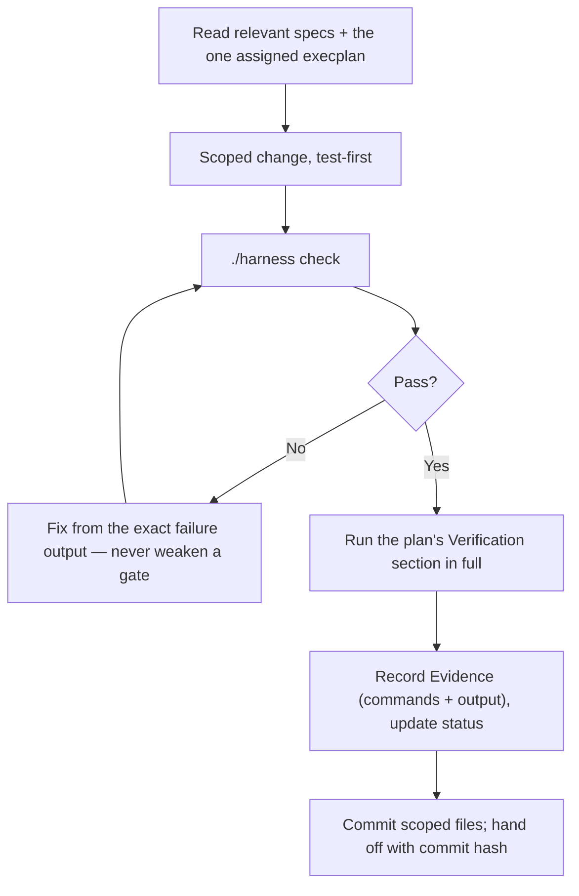
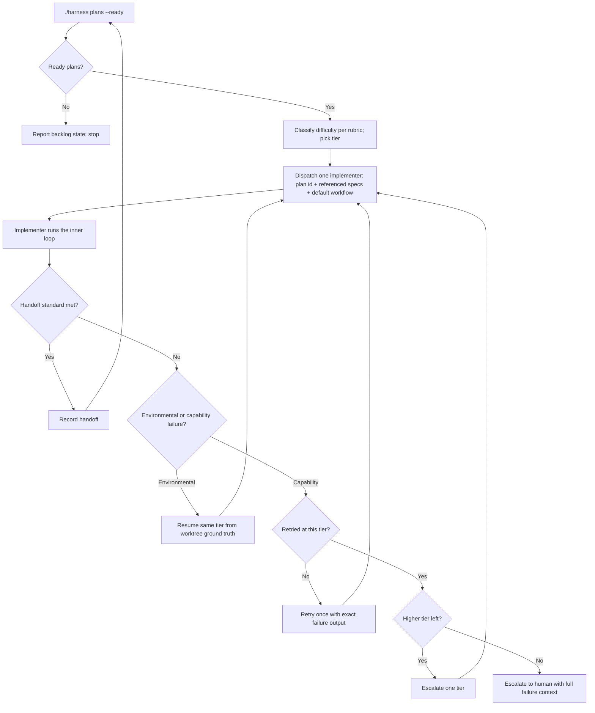

# Loop Engineering — Vega Plan Hub

Status: binding. Adopted 2026-07-17 from the portable kit in
`idiolect/docs/portable/`. Companion to
[harness.spec.md](harness.spec.md), which defines the deterministic
substrate these loops run on.

## The loop stack

Three nested loops plus one meta-loop, each with a defined driver, exit
condition, and evidence trail. The design goal for every loop:
**restartable from repository state alone** — any loop can die (provider
limits, outages, context exhaustion) and a fresh session resumes it from
committed files, plan frontmatter, and caches, never from memory of the
conversation.

| Loop | Driver | One iteration | Exit |
| --- | --- | --- | --- |
| Inner (execution) | one implementer agent | red → green → refactor → `./harness check` | plan's Verification passes |
| Outer (orchestration) | orchestrator agent | query ready → classify → dispatch → verify handoff | backlog empty or escalation |
| Human (on the loop) | the human | escalation brief → decision → recorded outcome | decision recorded in specs/plans |
| Meta (retrospective) | orchestrator, end of every run | audit run → convert gaps to checks/plans | findings landed or escalated |

## Inner loop: one plan, one implementer

Rules:

- One implementer, one plan, one scoped commit. No drive-by edits, no
  scope growth: if the plan conflicts with a spec, needs a new
  dependency, or drifts toward a non-goal, **stop and report** — the
  orchestrator decides.
- Evidence is commands and output, appended to the plan as you go.
- `./harness check` runs before every handoff — never negotiable.

### Runner lore

- **Long API/LLM loops run in the foreground.** Never background a run
  and end the turn "to wait" — the session pauses and nobody resumes it.
- **On resume after a session death**, re-derive ground truth from the
  worktree (`git status`, output files) before continuing — do not trust
  memory of progress, and do not redo work the worktree proves is done.
- **Cache-first for every LLM call** if this repo ever makes them
  (content-addressed key: model + template version + inputs).

## Outer loop: orchestration

The orchestrator routes, dispatches, and verifies — it **never
implements**. Every deterministic decision is a harness query:

| Question | Answered by |
| --- | --- |
| What is dispatchable now? | `./harness plans --ready` (sole source) |
| Is the backlog coherent? | `./harness plans --validate` |
| Did the change pass? | `./harness check` |

### Dispatch rules

- **Serial by default**: one implementer, one plan, one scoped commit.
  Parallel dispatch over disjoint file footprints in isolated worktrees
  is a later optimization, not a starting point.
- **Vertical over horizontal**: prefer the slice that reaches the next
  *human-reviewable output* over completing a layer.
- Give each implementer only what it needs: the plan id, the spec files
  the plan references, and the default workflow — never the whole corpus.
- Verify every handoff against the handoff standard; re-run
  `./harness check` yourself if the note is ambiguous.

### Capability tiers and the escalation ladder

Tiers are capability + effort, **never vendor model names** (keep any
mapping table dated and non-normative — it rots). Dispatch at the lowest
tier the rubric supports.

| Tier | Profile | Routes here when |
| --- | --- | --- |
| Orchestrator | Frontier model, medium effort | Never implements. |
| T1 | Workhorse model, medium effort | Mechanical, pattern-following, single-module work the spec fully determines (a new shadcn-patterned component; a recipe data file; CLI wiring). |
| T2 | Workhorse model, high–max effort | First-of-kind design inside a fixed contract, or cross-module integration (a new page + service + hook slice). |
| T3 | Frontier model | Contract-adjacent ambiguity, algorithmic novelty — and anything that failed at T2. |
| Apex | Strongest frontier model, maximum effort | One dispatch, after T3 failure, before the human. |
| Human | On the loop | Contract changes, gate changes, disputes, exhausted tiers. |

Failure policy: first **diagnose the failure class**. Environmental
failures (provider limits, outages, session deaths) resume at the same
tier from worktree ground truth and never count against the ladder.
Capability failures walk it: one retry at the same tier with the exact
failure output → one tier up → one apex dispatch → the human.

## Human loop: on, not in

The orchestrator proceeds autonomously through routine dispatch and
verification, and **must stop and escalate — never act autonomously —
on**:

- any change to `docs/specs` (contract changes are human decisions);
- weakening, skipping, or reordering any harness gate;
- drift into a stated non-goal;
- a disputed spec interpretation between orchestrator and implementer;
- adding a dependency;
- failure remaining after a T3/apex dispatch;
- plans whose Verification requires human review of outputs.

### Escalation brief (required shape)

1. **The decision in one sentence**, phrased as a question, with a
   default if one exists.
2. **What the contract already says** — search the specs first; never
   re-litigate a recorded decision.
3. **Options table** with concrete trade-offs and affected downstream
   plans.
4. **A diagram when the decision has structure** (Mermaid).
5. **Your recommendation and why, clearly marked as yours.**

## Meta loop: the retrospective

Every orchestration run ends with a four-part retrospective before the
final handoff — the standing trigger for the self-improvement rule:

1. **Orchestrator.** Did classification, dispatch, and verification
   follow the rubric? Name every judgment call the human should review.
2. **Harness.** Did any verification rely on model judgment over
   deterministic facts? Each case ⇒ dispatch a scoped implementer to add
   the missing harness check *in the same session*.
3. **Implementation.** Grade each handoff: evidence quality, residual
   risks. A deferred risk must land in `docs/execplans/` — never only in
   a handoff note.
4. **Maturity ratchet audit.** Compare the harness against the maturity
   ladder and Planned Commands table in
   [harness.spec.md](harness.spec.md): name every gap and dispatch or
   queue its closure. Then propose what the rung above the ladder's top
   should be — as an escalation brief, adopted only by human decision.

Report the retrospective in the final handoff. Findings that would
change a contract go to the human, never into the change set.

## Loop-engineering principles (the checklist)

1. **Restartable from repo state.**
2. **Deterministic queries, model judgment only at the edges.**
3. **Evidence as you go.**
4. **Scoped commits per iteration** — the commit hash is the checkpoint
   token.
5. **Cache-first side effects.**
6. **Cheapest capable tier, ladder up on failure** — and distinguish
   environmental from capability failure before burning a rung.
7. **Human on defined triggers only.**
8. **Every run feeds the ratchet.** A loop that only produces output —
   and not also an improvement to the machinery that produced it — is a
   Level-0 loop.
